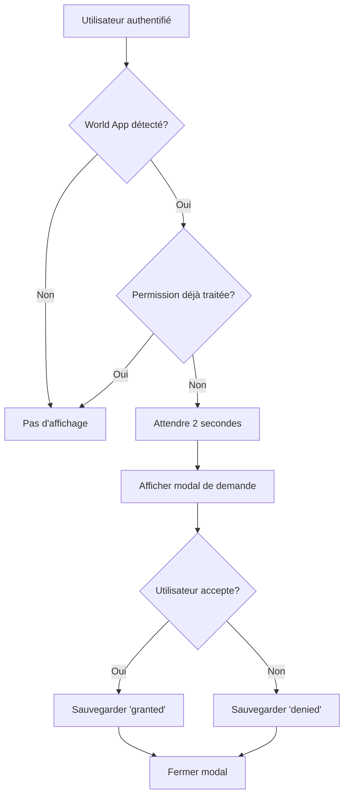

# Implémentation des Permissions de Notifications - Hoshima

## Vue d'ensemble

Ce système implémente la demande de permissions de notifications pour tous les utilisateurs qui n'ont pas encore autorisé les notifications à l'ouverture de l'application. L'état des permissions est sauvegardé dans le localStorage conformément à la documentation World Mini App.

## Fonctionnalités

✅ **Demande automatique** : Affichage automatique d'une modal de demande de permission après 2 secondes  
✅ **Sauvegarde localStorage** : État des permissions persisté localement  
✅ **Synchronisation BDD** : État synchronisé avec la base de données backend  
✅ **Respect de la politique** : Ne demande qu'une seule fois par utilisateur  
✅ **Support multilingue** : Interface traduite dans toutes les langues supportées  
✅ **Design cohérent** : Interface utilisant le design system existant  
✅ **Gestion d'erreurs** : Traitement complet des différents codes d'erreur  
✅ **APIs complètes** : Endpoints pour statistiques et gestion des utilisateurs  

## Structure des fichiers

```
hoshima-project/src/
├── hooks/
│   └── useNotificationPermission.ts     # Hook principal pour gérer les permissions
├── components/
│   └── NotificationPermissionManager.tsx # Composant UI pour la demande
├── utils/
│   └── notificationDebugger.ts          # Utilitaires de debug
└── app/
    └── page.tsx                          # Intégration dans l'app principale

backend/
├── models/
│   └── User.js                           # Modèle User avec champs notifications
├── routes/
│   └── notificationRoutes.js           # Routes API pour les notifications
└── server.js                           # Configuration des routes
```

## Utilisation

### 1. Hook `useNotificationPermission`

```typescript
import { useNotificationPermission } from '@/hooks/useNotificationPermission';

const {
  status,                           // 'granted' | 'denied' | 'unknown' | 'not_requested'
  isRequesting,                     // Boolean - demande en cours
  hasBeenRequested,                 // Boolean - déjà demandé
  shouldRequestPermission,          // Function - doit-on demander ?
  requestNotificationPermission,    // Function - demander les permissions
  resetPermissionState,             // Function - réinitialiser (debug)
  isWorldAppInstalled              // Boolean - World App disponible
} = useNotificationPermission();
```

### 2. Composant `NotificationPermissionManager`

```jsx
<NotificationPermissionManager
  delay={2000}                      // Délai avant affichage (ms)
  forceShow={false}                 // Forcer l'affichage (debug)
  onPermissionHandled={(granted) => {
    console.log('Permission:', granted ? 'accordée' : 'refusée');
  }}
/>
```

## Configuration localStorage

Le système utilise 3 clés dans le localStorage :

- `hoshima_notification_permission` : Status de la permission ('granted', 'denied', etc.)
- `hoshima_notification_requested` : Boolean - si déjà demandé
- `hoshima_notification_timestamp` : Timestamp de la dernière demande

## Base de données

### Modèle User (nouveau champs)

```javascript
// Ajouté au schema User existant
notificationPermission: {
  type: String,
  enum: ['granted', 'denied', 'not_requested', 'unknown'],
  default: 'not_requested'
},
notificationPermissionRequested: {
  type: Boolean,
  default: false
},
notificationPermissionTimestamp: {
  type: Date,
  default: null
}
```

### APIs Backend

#### `PUT /api/notifications/permission`
Met à jour le statut des permissions pour un utilisateur.

```javascript
// Body
{
  "userId": "world_123...",        // ou walletAddress
  "walletAddress": "0x123...",     // optionnel si userId fourni
  "status": "granted",             // granted|denied|not_requested|unknown
  "timestamp": 1640995200000       // timestamp Unix
}

// Response
{
  "success": true,
  "data": {
    "userId": "world_123...",
    "notificationPermission": "granted",
    "notificationPermissionRequested": true,
    "notificationPermissionTimestamp": "2023-12-31T12:00:00.000Z"
  }
}
```

#### `GET /api/notifications/permission/:identifier`
Récupère le statut des permissions d'un utilisateur.

```javascript
// Query params
?type=wallet  // 'wallet' pour chercher par adresse, sinon par userId

// Response
{
  "success": true,
  "data": {
    "userId": "world_123...",
    "notificationPermission": "granted",
    "notificationPermissionRequested": true,
    "notificationPermissionTimestamp": "2023-12-31T12:00:00.000Z"
  }
}
```

#### `GET /api/notifications/stats`
Statistiques globales des permissions.

```javascript
// Response
{
  "success": true,
  "data": {
    "total": 1250,
    "breakdown": [
      { "status": "granted", "count": 875, "percentage": 70 },
      { "status": "denied", "count": 125, "percentage": 10 },
      { "status": "not_requested", "count": 250, "percentage": 20 }
    ],
    "lastUpdated": "2023-12-31T12:00:00.000Z"
  }
}
```

#### `GET /api/notifications/users`
Liste des utilisateurs par statut de permission.

```javascript
// Query params
?status=granted&limit=100&offset=0

// Response
{
  "success": true,
  "data": {
    "users": [
      {
        "userId": "world_123...",
        "walletAddress": "0x123...",
        "worldUsername": "alice",
        "notificationPermission": "granted",
        "notificationPermissionTimestamp": "2023-12-31T12:00:00.000Z",
        "lastSeen": "2023-12-31T11:30:00.000Z"
      }
    ],
    "pagination": {
      "total": 875,
      "limit": 100,
      "offset": 0,
      "hasMore": true
    }
  }
}
```

## Gestion des erreurs

Le système gère tous les codes d'erreur de l'API World Mini App :

| Code d'erreur | Signification | Action |
|----------------|---------------|---------|
| `user_rejected` | Utilisateur a refusé | Sauvegarde comme 'denied' |
| `already_granted` | Déjà accordé | Sauvegarde comme 'granted' |
| `already_requested` | Déjà demandé et refusé | Ne redemande pas |
| `permission_disabled` | Notifications désactivées dans World App | Lien vers les paramètres |
| `unsupported_permission` | Permission non supportée | Affichage d'un message d'info |
| `generic_error` | Erreur générique | Retry possible |

## Traductions

Les traductions sont disponibles dans toutes les langues supportées :

```json
{
  "notifications": {
    "permissionTitle": "Stay Updated with Hoshima",
    "permissionDescription": "Get notified about important updates...",
    "allowNotifications": "Allow Notifications",
    "notNow": "Not Now",
    "requesting": "Requesting...",
    "openSettings": "Open World App Settings",
    "privacyNote": "You can change this setting anytime..."
  }
}
```

## Debug et test

### Console de debug

Utilisez `NotificationDebugger` dans la console du navigateur :

```javascript
// Voir l'état actuel
NotificationDebugger.logPermissionState();

// Rapport complet
NotificationDebugger.fullReport();

// Réinitialiser les permissions
NotificationDebugger.resetPermissions();

// Simuler un état accordé
NotificationDebugger.simulateGranted();

// Simuler un état refusé
NotificationDebugger.simulateDenied();

// Vérifier MiniKit
NotificationDebugger.checkMiniKitAvailability();
```

### Mode forcé pour test

Pour tester l'interface, utilisez le mode forcé :

```jsx
<NotificationPermissionManager forceShow={true} />
```

### Test des APIs backend

Utilisez le script de test fourni :

```bash
node test-notifications.js
```

Ce script teste :
- ✅ Mise à jour des permissions (granted/denied)
- ✅ Récupération des permissions par userId/walletAddress  
- ✅ Statistiques globales
- ✅ Liste des utilisateurs par statut
- ✅ Gestion des erreurs (utilisateur inexistant, statut invalide)
- ✅ Cas limites et validation

### Tests manuels

1. **Test frontend** : Ouvrir l'app dans World App, se connecter, autoriser/refuser
2. **Test backend** : Vérifier les logs backend et la base de données
3. **Test APIs** : Utiliser curl ou Postman pour tester les endpoints
4. **Test synchronisation** : Vérifier que localStorage et BDD sont cohérents

## Intégration dans l'application

Le composant est intégré dans `page.tsx` et s'affiche automatiquement :

1. **Après l'authentification** de l'utilisateur
2. **Avec un délai de 2 secondes** pour ne pas interrompre l'UX
3. **Seulement si les permissions n'ont pas été traitées** auparavant
4. **Uniquement dans World App** (MiniKit détecté)

## Workflow utilisateur



## Remarques importantes

- ⚠️ **Une seule demande par utilisateur** : Conforme aux guidelines World App
- 🔐 **Sécurisé** : Toutes les validations côté client et serveur
- 🌍 **Multilingue** : Support de toutes les langues de l'app
- 📱 **World App uniquement** : Ne s'affiche que dans l'environnement approprié
- 💾 **Persistance** : État sauvegardé localement pour la session

## Usage pratique

### Envoyer des notifications ciblées

```javascript
// 1. Récupérer les utilisateurs qui ont accordé les permissions
const response = await fetch('/api/notifications/users?status=granted&limit=1000');
const { users } = await response.json();

// 2. Extraire les adresses wallet
const walletAddresses = users.data.users.map(user => user.walletAddress);

// 3. Envoyer via Developer Portal ou API World App
// (selon la documentation officielle)
```

### Analyser les statistiques

```javascript
// Récupérer les stats en temps réel
const stats = await fetch('/api/notifications/stats').then(r => r.json());

console.log(`Taux d'acceptation: ${stats.data.breakdown.find(s => s.status === 'granted').percentage}%`);
console.log(`Total utilisateurs avec notifications: ${stats.data.breakdown.find(s => s.status === 'granted').count}`);
```

### Surveiller les nouvelles permissions

```javascript
// Dashboard pour monitoring en temps réel
setInterval(async () => {
  const stats = await fetch('/api/notifications/stats').then(r => r.json());
  updateDashboard(stats.data);
}, 30000); // Check toutes les 30 secondes
```

## Prochaines étapes

Une fois cette implémentation en place, vous pourrez :

1. **Envoyer des notifications** via l'API World App ou le Developer Portal
2. **Segmenter les utilisateurs** selon leurs permissions
3. **Analyser les taux d'acceptation** via les statistiques
4. **Implémenter des rappels** pour les utilisateurs qui ont refusé
5. **Créer un dashboard** de monitoring des permissions
6. **Optimiser les taux de conversion** selon les données collectées

Pour envoyer des notifications, consultez la documentation World Mini App sur l'envoi de notifications. 